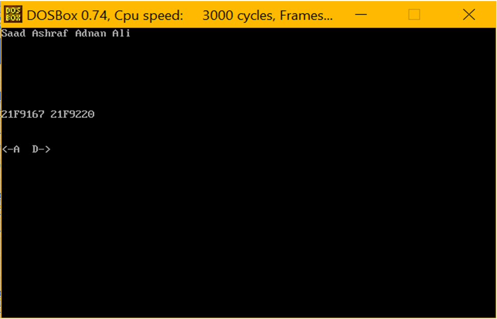
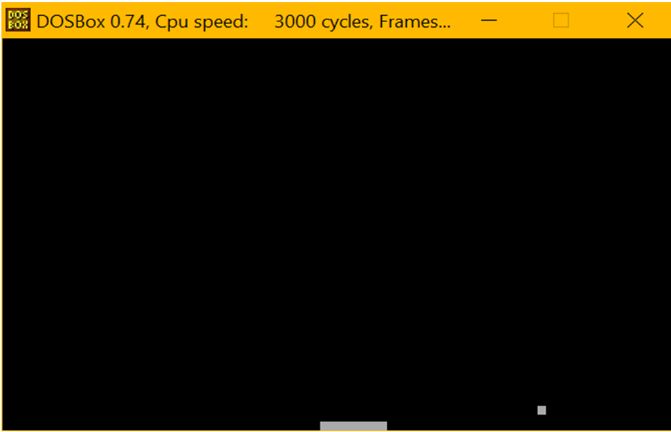

# 🍎 Apple Catch Game — Assembly Language Project

A classic paddle-based **fruit-catching game** developed in **x86 Assembly Language** using **TASM**, designed to run in a DOS environment (DOSBox). The player must catch falling apples using a controllable paddle at the bottom of the screen. The game demonstrates low-level graphics manipulation, interrupt handling, and direct memory control — all using pure Assembly.

> Developed by **Adnan Ali** as part of the Computer Architecture Lab (COAL) — Fall 2025.

---

## 🎮 Game Overview

- The paddle moves **left** (`A`) and **right** (`D`).
- Apples fall from the top of the screen.
- The objective is to catch the apple using the paddle.
- The game ends when all lives are lost.

This game showcases **real-time movement**, **keyboard input**, **score tracking**, and **collision detection** in **text-mode video memory (0xB800)**.

---

## 🔧 Technologies Used

- **x86 Assembly Language**
- **TASM** (Turbo Assembler)
- **DOSBox** Emulator
- **BIOS & DOS Interrupts**
- **Direct Video Memory Access**

---

## 📁 Project Structure

Apple-Catch-Game/
├── apple_catch.asm # Complete source code
├── README.md # Project documentation
└── assets/
├── screenshot1.png # Login/Start screen
└── screenshot2.png # Gameplay snapshot

---

## 🧠 Key Features

✅ Real-time paddle and object movement  
✅ Keyboard input via **INT 16h**  
✅ Direct manipulation of **video memory**  
✅ Collision detection and scoring system  
✅ Game over screen and score display  
✅ Manual delay loop for timing control  
✅ Fully developed in **Real Mode Assembly**

---

## 🖼️ Screenshots

### 🔐 Start Screen  


### 🍏 Gameplay  


---

## 🚀 How to Run

1. Install [DOSBox](https://www.dosbox.com/)
2. Install [TASM](https://winworldpc.com/product/turbo-assembler/5x)
3. Place `apple_catch.asm` inside DOSBox-mounted folder
4. Run the following commands:

```asm
tasm apple_catch.asm
tlink apple_catch.obj
apple_catch.exe
Learning Outcomes
Deep understanding of low-level programming

Practice with stack operations, interrupts, and I/O control

Applied knowledge of looping, conditionals, and memory layout

Familiarity with real-mode segmentation, BIOS services, and VGA text mode

👨‍💻 Developer
Adnan Ali
Student – BS Computer Science
Fall 2025 – Department of Computer Science

📜 License
This project is for educational purposes only.
You are free to fork or reference this code for learning and academic use.